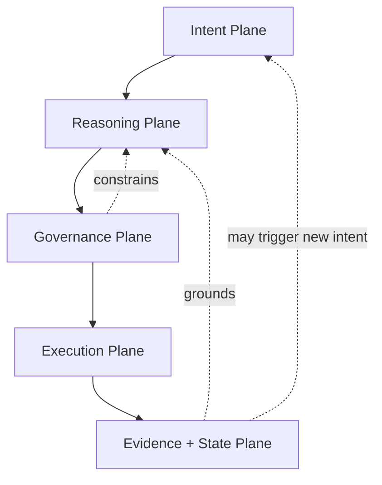
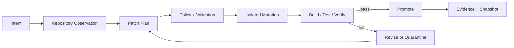

# MintpathOS

## Governed Autonomous AI Infrastructure

**Public Architecture Whitepaper**  
**Version 2.0 · August 2026**  
**Patent Pending**

Mintpath LLC

> This document describes system behavior and architecture. Proprietary implementation mechanisms, production configuration, credentials, security-sensitive topology, and certain internal algorithms are intentionally abstracted.

---

## 1. Executive Summary

MintpathOS is a governance-first runtime for autonomous and agentic AI systems. It is designed to let foundation models perform semantic interpretation, planning, reasoning, decomposition, synthesis, and adaptive decision support without making the model itself the final authority over permissions, execution, system state, or truth.

The central architectural principle is separation of concerns.

A probabilistic model can propose that an action should occur. A deterministic control system decides whether that action is admissible. An execution substrate determines how it occurs. Verification establishes what can be supported as having happened. Evidence and authoritative state determine what the rest of the system is subsequently allowed to believe.

This produces a fundamentally different execution path from a conventional tool-using agent:

```text
intent → reasoning → bounded representation → policy → execution → verification → evidence → authoritative state
```

Rather than:

```text
prompt → model → tool call → assumed success
```

MintpathOS applies this architecture across autonomous software development, multi-agent reasoning, application runtimes, persistent memory, real-time operator interfaces, and domain-specific AI systems.

The production codebase is private. This document describes the public architectural surface.

---

## 2. The Problem: Intelligence Is Not Authority

Foundation models are useful in part because they are probabilistic and can generalize from context.

They can interpret incomplete instructions, synthesize information, recognize patterns, generalize across unfamiliar situations, and produce candidate solutions where deterministic software would require an impractical number of explicitly encoded branches.

Those same properties make them poor authorities.

A model can misunderstand a request, hallucinate a fact, select the wrong tool, construct malformed parameters, overlook changed state, repeat an operation, act outside an intended scope, or produce a convincing explanation for something that never occurred.

A common response is to improve the prompt or surrounding agent instructions.

MintpathOS takes a different position: **authority should not live in the prompt in the first place.**

The model is an inference layer.

System state, permissions, policy, evidence, execution contracts, provenance, and mutation authority remain separately represented and independently enforceable.

This distinction is the foundation of the architecture.

---

## 3. Architectural Model

MintpathOS can be understood as five interacting planes:



### Intent Plane

Human requests, autonomous goals, scheduled work, application events, environmental changes, and agent-generated tasks enter the system as intent.

Where possible, intent is normalized into typed or bounded operational structures before execution.

### Reasoning Plane

Foundation models interpret context, construct plans, classify situations, compare alternatives, synthesize evidence, and produce candidate actions.

Different models can be selected for different cognitive tasks.

### Governance Plane

Policy, capability, risk, data class, scope, identity, confirmation requirements, invariants, and execution contracts determine what candidate actions are admissible.

The governance plane is not delegated to the same model proposing the action.

### Execution Plane

Approved operations run through explicit execution machinery rather than direct model authority.

Execution may involve tools, APIs, databases, code modification, agent dispatch, application services, or other controlled effects.

### Evidence and State Plane

Results become durable observations, receipts, artifacts, events, claims, or authoritative records.

Future reasoning is grounded against this state rather than assuming that a requested or proposed action succeeded.

---

## 4. Governor and Policy-Bounded Execution

Governor represents the execution-authority concept inside MintpathOS.

Its purpose is not to make a model more cautious. Its purpose is to ensure that model caution is not the security boundary.

The execution path can enforce:

* authenticated identity;
* organization or tenant scope;
* role and capability boundaries;
* action-specific authorization;
* data-class restrictions;
* typed arguments;
* effect classes;
* expiry and replay controls;
* confirmation requirements;
* risk budgets;
* preconditions;
* postconditions;
* immutable execution records;
* failure isolation.

High-impact operations can therefore require stronger authority than low-impact analysis.

A model can recommend a destructive or financial operation without automatically acquiring the authority to execute it.

This distinction becomes increasingly important as models become more capable. Better reasoning should increase the usefulness of the system without proportionally increasing the blast radius of a reasoning failure.

---

## 5. Epoch, Evidence, and Validity Kernels

Autonomous systems require more than logs.

A log can tell an operator that an event occurred. It does not necessarily establish what evidence justified the event, whether the evidence was valid, what conclusion was drawn from it, or what downstream claims inherited that conclusion.

MintpathOS uses an evidence-oriented architecture centered around durable execution artifacts and validity evaluation.

Conceptually, an autonomous action can produce:

1. an intent;
2. the context used to reason about that intent;
3. the candidate plan or operation;
4. the applicable policy decision;
5. execution receipts;
6. observed results;
7. evidence derived from those results;
8. claims supported by that evidence;
9. promotion or rejection decisions;
10. links to downstream actions.

Validity Kernels provide deterministic or narrowly scoped validation where exact semantics matter.

The result is a provenance graph rather than a transcript of model confidence.

The architecture also preserves a distinction between evidence and authority. Evidence can support a claim without automatically promoting that claim into authoritative system state.

This architecture supports forensic questions such as:

* What did the system believe at the time?
* What evidence supported that belief?
* Which model or deterministic component produced the inference?
* What policy authorized the operation?
* What code or configuration was active?
* What changed?
* What verifier accepted the result?
* What downstream decision relied on it?

That is the difference between an autonomous system that can explain itself and one that can merely produce a plausible retrospective narrative.

---

## 6. Replayability

Replayability is treated as an architectural property rather than a debugging convenience.

Where an operation can affect durable system state, MintpathOS attempts to preserve enough structured information to reconstruct the decision path: input state, policy context, bounded operation, relevant artifacts, execution result, and evidence.

Not every external side effect can literally be repeated. Sending a payment twice would not be replayability.

The relevant requirement is **decision replay** and **forensic reconstruction**: the system should be able to establish how an action was reached without asking a model to remember or recreate its reasoning from scratch.

This enables testing, auditing, incident reconstruction, regression analysis, and safer autonomous evolution.

---

## 7. Intent Compilation and Bounded Operations

Free-form natural language is valuable at the human boundary and dangerous at the mutation boundary.

MintpathOS therefore uses intent-compilation patterns, including the M-CON architecture, to translate higher-level requests into bounded operational representations.

The goal is not to eliminate natural-language reasoning. It is to prevent natural language from being the final execution format.

A bounded operation can specify:

* operation type;
* target;
* required inputs;
* allowed effects;
* invariants;
* validators;
* confirmation semantics;
* success conditions;
* rollback or recovery behavior.

This creates a narrow waist between flexible intelligence and deterministic execution.

A model can express creativity above that waist. The system can remain rigid below it.

---

## 8. Architect and Multi-Agent Orchestration

Complex tasks frequently exceed the useful scope of one sequential model call.

MintpathOS includes orchestration machinery for decomposing work into specialized tasks, assigning capabilities, executing work concurrently where safe, reconciling results, and recovering failed branches.

The Architect layer provides higher-level planning and operator interaction.

Multi-Agent Distributed Dispatch extends this into skill-oriented execution waves in which work is treated as a governed task rather than an anonymous queue item.

The important distinction is that delegation does not erase policy.

A subordinate agent does not inherit unlimited authority simply because another agent dispatched it. The dispatched task can carry its own scope, allowed capabilities, evidence requirements, and completion semantics.

---

## 9. Multi-Model Reasoning and Roundtable

MintpathOS is intentionally model-agnostic.

Different models have different strengths, latency profiles, costs, context capabilities, tool behavior, multimodal support, and failure modes. Routing is therefore treated as a policy and capability problem rather than a permanent allegiance to one provider.

The architecture supports multiple providers within one runtime and model selection by task characteristics.

For higher-ambiguity reasoning, MintpathOS also includes Roundtable-style multi-model collaboration.

Rather than asking several models for independent answers and averaging them, Roundtable enables adversarial or complementary reasoning in which models can inspect the same problem from different perspectives and the system can synthesize the resulting reasoning artifacts, disagreements, and candidate conclusions.

The value is not “more agents.”

The value is structured cognitive diversity under one execution authority.

---

## 10. Recursive Software Evolution

One of the hardest autonomous workflows is modifying the system that performs the modification.

MintpathOS treats code mutation as a governed execution problem.

The Code Repair Framework and MintPatch architecture use snapshot-backed mutation, bounded patch representations, validation, build or test gates, and recovery semantics so autonomous software work does not reduce to an LLM writing directly into production source.

A typical high-level cycle is:



The system can therefore use model intelligence to reason about software while preserving deterministic boundaries around how source is changed and how changes become authoritative.

This is the basis for recursive coherence: the ability to inspect and repair portions of the system's own schemas, pipelines, logic, and implementation without granting the reasoning model unrestricted mutation authority.

---

## 11. Structural Coherence

Autonomous modification becomes unsafe when different representations of the same system silently drift.

MintpathOS includes cross-layer coherence mechanisms, historically described as the Liquid Crystal architecture, intended to keep database schemas, application types, runtime validators, API contracts, and generated representations aligned.

The objective is not aesthetic consistency.

It is prevention of a dangerous class of autonomous failures in which one component believes an operation is valid because its local schema no longer matches the authoritative system contract.

Schema evolution, type evolution, runtime validation, migration behavior, and compatibility checks therefore belong inside the autonomy problem.

---

## 12. Memory and Situational Awareness

Persistent autonomy requires memory, but memory itself cannot be treated as unquestioned truth.

MintpathOS supports persistent retrieval while maintaining distinctions between observations, stored context, evidence, claims, and current authoritative state.

Semantic retrieval can surface relevant historical material. Deterministic filters and current-state reads prevent an old embedding from silently overriding fresh system reality.

Situational-awareness components, including filesystem and database observation, allow the system to react to changes rather than relying exclusively on serialized prompt snapshots.

This matters because long-running agents operate in environments that continue changing while they reason.

The architecture therefore favors fresh tool-backed reads for state that can drift.

---

## 13. Deterministic Behavioral Substrates

MintpathOS includes deterministic internal-state mechanisms referred to as biologic substrates.

The term does not imply consciousness or biological equivalence.

These are explicit state machines and control variables that influence execution posture using factors such as workload, trust, confidence, urgency, or operational condition.

Their purpose is to move persistent behavior out of prompt-level personality.

A language model can describe itself as cautious while behaving recklessly on the next turn. A deterministic behavioral substrate can actually alter thresholds, escalation behavior, routing, or allowed actions.

This provides continuity of operational posture without pretending that anthropomorphic language is governance.

---

## 14. Liquid Control Plane and Real-Time State

Autonomous infrastructure requires an operator surface capable of showing more than chat messages.

The Liquid Control Plane provides a projection layer across system state, events, intents, guarded operations, and change artifacts.

Its conceptual primitives include:

* a structural world representation;
* an ordered event spine;
* operator or autonomous control intents;
* guarded state mutation;
* durable change artifacts;
* real-time projections.

MintpathOS also includes real-time session and transport infrastructure using WebSocket and streaming patterns for interactive applications, with explicit state, recovery, and fallback behavior.

The control plane exists so autonomy remains observable while it is running, not merely explainable after it stops.

---

## 15. Product Runtimes and Domain Boundaries

MintpathOS is not limited to generic autonomous software work.

Application runtimes can inherit its governance principles while defining stricter domain-specific boundaries.

Archie Sales Coach is one example.

The Archie runtime introduces concepts such as:

* authenticated durable sessions;
* bounded event protocols;
* data-class-aware provider policy;
* protected streaming media;
* explicit consent state;
* evidence-linked evaluation;
* resumable execution;
* provenance-aware debriefs;
* application-specific permissions;
* fail-closed model eligibility.

MintClinic remains authoritative for clinic operational state.

Archie can reason over clinic context, but its reasoning does not silently rewrite the CRM, fabricate consent, or substitute inferred outcomes for saved source records.

This is intentional. Domain applications should not be forced to surrender their source-of-truth semantics merely because AI is added to the workflow.

The same infrastructure principle applies broadly: **AI should enter an existing authority model rather than quietly replacing it.**

---

## 16. Multi-Layer Safety Model

MintpathOS does not depend on one universal safety mechanism.

Different failure classes require different controls.

| Failure class                  | Structural response                              |
| ------------------------------ | ------------------------------------------------ |
| Hallucinated fact              | Evidence and source-state grounding              |
| Invalid action                 | Typed validation                                 |
| Unauthorized action            | Capability and scope enforcement                 |
| High-risk mutation             | Stronger confirmation and policy                 |
| Duplicate execution            | Identity, expiry, replay controls                |
| Stale context                  | Fresh authoritative reads                        |
| Broken autonomous patch        | Snapshot, build/test gates, rollback             |
| Model/provider incompatibility | Policy-based routing and fail-closed eligibility |
| Partial execution              | Durable state and recovery semantics             |
| Ambiguous reasoning            | Multi-model or human escalation                  |
| Drift between representations  | Cross-layer schema coherence                     |

The system is designed so that no single prompt, model, verifier, or policy check carries the entire safety burden.

---

## 17. Human Authority and Sovereignty

Governed autonomy is not the removal of humans from the system.

It is the ability to decide precisely **where human authority is required and where it is not**.

Some operations can safely execute autonomously after machine verification.

Some require explicit human confirmation.

Some require a particular role.

Some should never be exposed to an AI agent at all.

MintpathOS is designed to make those distinctions structural rather than conversational.

The objective is not maximum autonomy.

The objective is maximum useful autonomy inside explicit authority boundaries.

---

## 18. Public Implementation Status

MintpathOS is an actively developed private production system.

The current implementation contains working infrastructure across autonomous workers, multi-provider model routing, persistent memory, real-time operator interfaces, multi-agent and Roundtable reasoning, evidence and validity systems, verified software mutation, dedicated streaming session runtimes, domain-specific application runtimes, and guarded execution.

This public document intentionally does not publish an exhaustive internal subsystem map, source inventory, production topology, credentials, security configuration, proprietary prompts, private datasets, or implementation-level defensive mechanisms.

---

## 19. Relationship to MintClinic and Archie

MintClinic and Archie are the clearest commercial application of the MintpathOS architecture.

MintClinic is the hearing-care CRM and operational system of record.

Archie Sales Coach is a governed AI coaching system built around explicit methodology, evidence-linked evaluation, patient-consented Live Assist, private debrief, longitudinal provider development, and revenue intelligence.

The model inside Archie is not the source of truth.

Foundation models handle semantic interpretation and adaptive reasoning. Explicit methodology, evidence references, consent state, permissions, deterministic controls, and authoritative clinic records constrain what the system can conclude, expose, or change.

That is MintpathOS applied to a real vertical.

The product-level architecture is documented separately in the [MintClinic + Archie technical whitepaper](https://github.com/Mintpath/mintclinic-whitepaper).

---

## 20. Conclusion

The difficult problem in autonomous AI is no longer simply giving a model access to tools.

The difficult problem is preserving authority, provenance, coherence, and recoverability after the model becomes capable enough to perform meaningful work.

MintpathOS is built around that problem.

Its architecture assumes that models will continue becoming more capable and that increasing capability should not require increasing trust in unverified model output.

Flexible intelligence belongs in the reasoning layer.

Authority belongs in explicit system structure.

Evidence determines what can be supported.

Policy determines what can become executable.

Verification determines what becomes accepted as authoritative state.

That separation is the foundation of governed autonomy.

---

## Appendix A: Public Architectural Primitives

The public MintpathOS architecture includes the following named concepts:

* **Governor / execution authority**: policy-bounded mutation and capability enforcement.
* **Epoch / Validity Kernels**: evidence, validation, provenance, and claim promotion.
* **Architect**: high-level planning, routing, and operator-facing orchestration.
* **MADD**: governed distributed task decomposition and skill dispatch.
* **Roundtable**: structured multi-model reasoning and adversarial synthesis.
* **M-CON**: bounded intent-to-operation compilation.
* **CRF / MintPatch**: snapshot-backed verified software mutation.
* **Liquid Crystal**: cross-layer structural coherence.
* **Liquid Control Plane**: operator-facing state and control projection.
* **Memory runtime**: persistent contextual retrieval under current-state grounding.
* **Peephole / situational awareness**: observation of changing filesystem and data state.
* **Biologic substrates**: deterministic behavioral and execution-posture state.
* **Multi-model routing**: capability-, policy-, cost-, and task-aware model selection.

These names identify architectural concepts, not an open-source API contract. Internal implementation details may change without corresponding changes to this public document.

---

## Appendix B: Disclosure Boundary

MintpathOS is proprietary software developed by Mintpath LLC.

This whitepaper is intended to explain architectural principles and demonstrated system behavior. It does not grant permission to reproduce proprietary implementation mechanisms, source code, internal datasets, security configuration, product methodology, or private infrastructure.

See `NOTICE.md`.
